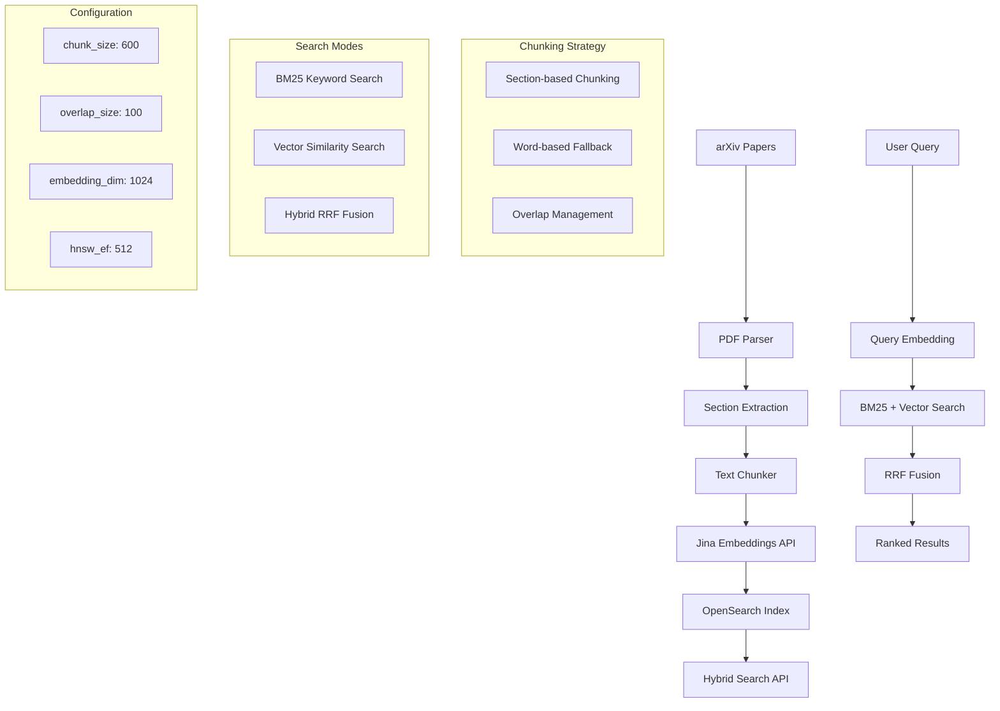

# RAG System: Chunking + Embedding + OpenSearch Implementation Analysis

## Overview

This codebase implements a **production-grade hybrid search system** that combines keyword search (BM25) with semantic vector search. The system processes academic papers through intelligent chunking, generates embeddings using Jina AI, and stores everything in OpenSearch for fast retrieval.

---

## PART 1: Codebase Analysis

### Step-by-Step Pipeline Explanation

#### 1. **Document Chunking** 📄

**What it does**: Breaks down long papers into smaller, searchable pieces while preserving context.

**Where it happens**: `src/services/indexing/text_chunker.py`

**Key Evidence**:
```python
# Lines 18-34: Configuration
def __init__(self, chunk_size: int = 600, overlap_size: int = 100, min_chunk_size: int = 100):
    self.chunk_size = chunk_size          # Target: 600 words per chunk
    self.overlap_size = overlap_size      # Overlap: 100 words between chunks
    self.min_chunk_size = min_chunk_size  # Minimum: 100 words for valid chunk
```

**How it works**:
- **Smart Strategy**: Uses section-based chunking when possible, falls back to word-based chunking
- **Section Logic**: 
  - Sections 100-800 words → Single chunk with title+abstract
  - Sections <100 words → Combined with adjacent sections
  - Sections >800 words → Split using traditional word-based chunking
- **Word-based Fallback**: 600-word chunks with 100-word overlaps

**Key Code Evidence**:
```python
# Lines 133-177: Word-based chunking logic
while current_position < len(words):
    chunk_start = current_position
    chunk_end = min(current_position + self.chunk_size, len(words))
    
    # Extract chunk words
    chunk_words = words[chunk_start:chunk_end]
    chunk_text = self._reconstruct_text(chunk_words)
    
    # Move to next chunk position (with overlap)
    current_position += self.chunk_size - self.overlap_size
```

**Why this approach**:
- **Context preservation**: Each chunk includes title + abstract for context
- **Overlap management**: 100-word overlaps maintain semantic continuity
- **Metadata filtering**: Removes duplicate abstracts and author information
- **Graceful degradation**: Falls back to word-based chunking if section parsing fails

#### 2. **Embedding Generation** 🤖

**What it does**: Converts text chunks into numerical vectors that capture semantic meaning.

**Where it happens**: `src/services/embeddings/jina_client.py`

**Key Evidence**:
```python
# Lines 44-46: Embedding request configuration
request_data = JinaEmbeddingRequest(
    model="jina-embeddings-v3", 
    task="retrieval.passage", 
    dimensions=1024, 
    input=batch
)
```

**How it works**:
- **Model**: Jina AI v3 embeddings (1024 dimensions)
- **Task-specific**: Different tasks for passages vs queries
- **Batch processing**: Processes 50-100 chunks at a time
- **API Integration**: Uses Jina AI's REST API with authentication

**Key Code Evidence**:
```python
# Lines 32-68: Batch embedding generation
async def embed_passages(self, texts: List[str], batch_size: int = 100):
    embeddings = []
    
    for i in range(0, len(texts), batch_size):
        batch = texts[i : i + batch_size]
        
        request_data = JinaEmbeddingRequest(
            model="jina-embeddings-v3", 
            task="retrieval.passage", 
            dimensions=1024, 
            input=batch
        )
        
        response = await self.client.post(
            f"{self.base_url}/embeddings", 
            headers=self.headers, 
            json=request_data.model_dump()
        )
        
        batch_embeddings = [item["embedding"] for item in result.data]
        embeddings.extend(batch_embeddings)
```

**Why Jina AI**:
- **Optimized for retrieval**: Specifically designed for search applications
- **High quality**: 1024-dimensional vectors capture semantic relationships
- **Fast**: Efficient API with good performance
- **Reliable**: Production-grade service with good uptime

#### 3. **OpenSearch Integration** 🔍

**What it does**: Stores chunks with embeddings and provides hybrid search capabilities.

**Where it happens**: `src/services/opensearch/client.py` and `src/services/opensearch/index_config_hybrid.py`

**Key Evidence**:
```python
# Lines 38-50: OpenSearch index mapping for embeddings
"embedding": {
    "type": "knn_vector",
    "dimension": 1024,  # Jina v3 embeddings dimension
    "method": {
        "name": "hnsw",  # Hierarchical Navigable Small World
        "space_type": "cosinesimil",  # Cosine similarity
        "engine": "nmslib",
        "parameters": {
            "ef_construction": 512,  # Higher value = better recall, slower indexing
            "m": 16,  # Number of bi-directional links
        },
    },
},
```

**How it works**:
- **Single unified index**: `arxiv-papers-chunks` supports all search modes
- **HNSW algorithm**: Hierarchical Navigable Small World for fast vector search
- **Cosine similarity**: Measures semantic similarity between vectors
- **Denormalized data**: Each chunk includes paper metadata for efficient search

**Key Code Evidence**:
```python
# Lines 78-100: Chunk data preparation for indexing
for chunk, embedding in zip(chunks, embeddings):
    chunk_data = {
        "arxiv_id": chunk.arxiv_id,
        "paper_id": chunk.paper_id,
        "chunk_index": chunk.metadata.chunk_index,
        "chunk_text": chunk.text,
        "chunk_word_count": chunk.metadata.word_count,
        "start_char": chunk.metadata.start_char,
        "end_char": chunk.metadata.end_char,
        "section_title": chunk.metadata.section_title,
        "embedding_model": "jina-embeddings-v3",
        # Denormalized paper metadata for efficient search
        "title": paper_data.get("title", ""),
        "authors": ", ".join(paper_data.get("authors", [])),
        "abstract": paper_data.get("abstract", ""),
        "categories": paper_data.get("categories", []),
        "published_date": paper_data.get("published_date"),
    }
    
    chunks_with_embeddings.append({"chunk_data": chunk_data, "embedding": embedding})
```

**Why OpenSearch**:
- **Native hybrid search**: Built-in support for BM25 + vector search
- **RRF pipeline**: Reciprocal Rank Fusion for combining search results
- **Scalable**: Handles large document collections efficiently
- **Production-ready**: Enterprise-grade search capabilities

#### 4. **Hybrid Search Implementation** 🔄

**What it does**: Combines keyword search (BM25) with semantic search (vector similarity) for better results.

**Where it happens**: `src/services/opensearch/client.py`

**Key Evidence**:
```python
# Lines 244-286: Native hybrid search with RRF
def _search_hybrid_native(self, query: str, query_embedding: List[float], size: int, categories: Optional[List[str]], min_score: float):
    builder = QueryBuilder(
        query=query, size=size * 2, from_=0, categories=categories, latest_papers=False, search_chunks=True
    )
    bm25_search_body = builder.build()
    
    bm25_query = bm25_search_body["query"]
    
    hybrid_query = {"hybrid": {"queries": [bm25_query, {"knn": {"embedding": {"vector": query_embedding, "k": size * 2}}}]}}
    
    # Execute search with RRF pipeline
    response = self.client.search(
        index=self.index_name, 
        body=search_body, 
        params={"search_pipeline": HYBRID_RRF_PIPELINE["id"]}
    )
```

**How it works**:
- **Three search modes**: BM25 only, vector only, hybrid (both combined)
- **RRF fusion**: Uses Reciprocal Rank Fusion to combine results
- **Query embedding**: Converts user query to vector for semantic search
- **Fallback strategy**: Falls back to BM25 if embeddings fail

**Key Code Evidence**:
```python
# Lines 72-85: RRF pipeline configuration
HYBRID_RRF_PIPELINE = {
    "id": "hybrid-rrf-pipeline",
    "description": "Post processor for hybrid RRF search",
    "phase_results_processors": [
        {
            "score-ranker-processor": {
                "combination": {
                    "technique": "rrf",  # Reciprocal Rank Fusion
                    "rank_constant": 60,  # Default k=60 for RRF formula: 1/(k+rank)
                }
            }
        }
    ],
}
```

**Why hybrid search**:
- **Best of both worlds**: Keyword precision + semantic understanding
- **Better recall**: Finds relevant documents even with different wording
- **Production proven**: Used by major search engines and RAG systems
- **Automatic weighting**: RRF handles the combination without manual tuning

### Complete Data Flow

#### **Indexing Flow** (Data → Chunks → Embeddings → OpenSearch)

**Location**: `src/services/indexing/hybrid_indexer.py`

```python
# Lines 48-103: Complete indexing workflow
async def index_paper(self, paper_data: Dict) -> Dict[str, int]:
    # Step 1: Chunk the paper using hybrid section-based approach
    chunks = self.chunker.chunk_paper(
        title=paper_data.get("title", ""),
        abstract=paper_data.get("abstract", ""),
        full_text=paper_data.get("raw_text", paper_data.get("full_text", "")),
        arxiv_id=arxiv_id,
        paper_id=paper_id,
        sections=paper_data.get("sections"),
    )
    
    # Step 2: Generate embeddings for chunks
    chunk_texts = [chunk.text for chunk in chunks]
    embeddings = await self.embeddings_client.embed_passages(
        texts=chunk_texts,
        batch_size=50,  # Process in batches
    )
    
    # Step 3: Prepare chunks with embeddings for indexing
    chunks_with_embeddings = []
    for chunk, embedding in zip(chunks, embeddings):
        chunk_data = {
            "arxiv_id": chunk.arxiv_id,
            "chunk_text": chunk.text,
            "embedding_model": "jina-embeddings-v3",
            # ... other metadata
        }
        chunks_with_embeddings.append({"chunk_data": chunk_data, "embedding": embedding})
    
    # Step 4: Index chunks into OpenSearch
    results = self.opensearch_client.bulk_index_chunks(chunks_with_embeddings)
```

#### **Search Flow** (Query → Embedding → Hybrid Search → Results)

**Location**: `src/routers/hybrid_search.py`

```python
# Lines 23-43: Search workflow
async def hybrid_search(request: HybridSearchRequest, opensearch_client: OpenSearchDep, embeddings_service: EmbeddingsDep):
    query_embedding = None
    if request.use_hybrid:
        try:
            query_embedding = await embeddings_service.embed_query(request.query)
        except Exception as e:
            logger.warning(f"Failed to generate embeddings, falling back to BM25: {e}")
            query_embedding = None
    
    results = opensearch_client.search_unified(
        query=request.query,
        query_embedding=query_embedding,
        size=request.size,
        use_hybrid=request.use_hybrid,
        min_score=request.min_score,
    )
```

### Configuration Points

**Location**: `src/config.py`

```python
# Lines 79-82: Chunking configuration
class ChunkingSettings:
    chunk_size: int = 600          # Target words per chunk
    overlap_size: int = 100        # Words to overlap between chunks
    min_chunk_size: int = 100      # Minimum words for valid chunk
    section_based: bool = True     # Use section-based chunking

# Lines 100-105: OpenSearch configuration
class OpenSearchSettings:
    vector_dimension: int = 1024   # Jina embeddings dimension
    vector_space_type: str = "cosinesimil"  # cosinesimil, l2, innerproduct
    rrf_pipeline_name: str = "hybrid-rrf-pipeline"
    hybrid_search_size_multiplier: int = 2  # Get k*multiplier for better recall
```

### End-to-End Architecture Diagram



---

## PART 2: Migration/Integration Guide

### What Needs to Be Added to an Existing RAG System

If you already have a working RAG system **without chunking, embedding, or OpenSearch**, here's what you need to add:

#### **Files and Modules to Migrate**

**1. Chunking Module**
- **Copy**: `src/services/indexing/text_chunker.py`
- **Copy**: `src/schemas/indexing/models.py`
- **Adapt**: Update imports to match your project structure
- **Configure**: Add chunking settings to your config

**2. Embedding Service**
- **Copy**: `src/services/embeddings/jina_client.py`
- **Copy**: `src/services/embeddings/factory.py`
- **Copy**: `src/schemas/embeddings/jina.py`
- **Configure**: Add Jina API key to your environment

**3. OpenSearch Integration**
- **Copy**: `src/services/opensearch/client.py`
- **Copy**: `src/services/opensearch/index_config_hybrid.py`
- **Copy**: `src/services/opensearch/query_builder.py`
- **Copy**: `src/services/opensearch/factory.py`
- **Configure**: Add OpenSearch connection settings

**4. Orchestration Service**
- **Copy**: `src/services/indexing/hybrid_indexer.py`
- **Copy**: `src/services/indexing/factory.py`
- **Adapt**: Modify to work with your existing data models

#### **Integration Points in Your RAG System**

**1. Document Ingestion Pipeline**
```python
# Add chunking step to your existing ingestion
from your_project.services.indexing.text_chunker import TextChunker

chunker = TextChunker(chunk_size=600, overlap_size=100)
chunks = chunker.chunk_paper(
    title=document.title,
    abstract=document.abstract,
    full_text=document.content,
    sections=document.sections
)
```

**2. Storage Layer**
```python
# Add OpenSearch indexing to your existing storage
from your_project.services.indexing.hybrid_indexer import HybridIndexingService

indexing_service = HybridIndexingService(chunker, embeddings_client, opensearch_client)
stats = await indexing_service.index_paper(document_data)
```

**3. Retrieval Layer**
```python
# Replace your existing search with hybrid search
from your_project.services.opensearch.client import OpenSearchClient

opensearch_client = OpenSearchClient(host, settings)
results = opensearch_client.search_unified(
    query=user_query,
    query_embedding=query_embedding,
    use_hybrid=True,
    size=10
)
```

#### **Dependencies to Add**

**1. Python Packages**
```bash
pip install opensearch-py httpx pydantic
```

**2. Environment Variables**
```bash
# Add to your .env file
JINA_API_KEY=your_jina_api_key
OPENSEARCH__HOST=http://localhost:9200
OPENSEARCH__INDEX_NAME=your-index-name
OPENSEARCH__CHUNK_INDEX_SUFFIX=chunks
CHUNKING__CHUNK_SIZE=600
CHUNKING__OVERLAP_SIZE=100
```

**3. OpenSearch Setup**
```bash
# Install OpenSearch
docker run -d --name opensearch -p 9200:9200 -e "discovery.type=single-node" opensearchproject/opensearch:latest
```

#### **Configuration Updates**

**1. Add to your config.py**
```python
class ChunkingSettings(BaseConfigSettings):
    chunk_size: int = 600
    overlap_size: int = 100
    min_chunk_size: int = 100
    section_based: bool = True

class OpenSearchSettings(BaseConfigSettings):
    host: str = "http://localhost:9200"
    index_name: str = "your-index"
    chunk_index_suffix: str = "chunks"
    vector_dimension: int = 1024
    vector_space_type: str = "cosinesimil"
    rrf_pipeline_name: str = "hybrid-rrf-pipeline"
```

**2. Update your main settings**
```python
class Settings(BaseConfigSettings):
    # ... existing settings ...
    jina_api_key: str = ""
    chunking: ChunkingSettings = Field(default_factory=ChunkingSettings)
    opensearch: OpenSearchSettings = Field(default_factory=OpenSearchSettings)
```

### Integration Checklist

#### **Phase 1: Setup and Configuration**
- [ ] **OpenSearch installed and running** (Docker or local installation)
- [ ] **Jina API key obtained** and added to environment variables
- [ ] **Dependencies installed** (opensearch-py, httpx, pydantic)
- [ ] **Configuration files updated** with chunking and OpenSearch settings
- [ ] **Environment variables set** for all required services

#### **Phase 2: Chunking Module Integration**
- [ ] **TextChunker class copied** and adapted to your project structure
- [ ] **ChunkMetadata and TextChunk models** integrated into your schemas
- [ ] **Chunking configuration** added to your settings
- [ ] **Chunking tests added** for your document types
- [ ] **Chunking integrated** into your document ingestion pipeline

#### **Phase 3: Embedding Generation**
- [ ] **JinaEmbeddingsClient copied** and adapted
- [ ] **Embedding schemas** (JinaEmbeddingRequest/Response) integrated
- [ ] **Embedding factory** adapted to your dependency injection system
- [ ] **Embedding generation tested** with sample documents
- [ ] **Batch processing** configured for your document volume

#### **Phase 4: OpenSearch Integration**
- [ ] **OpenSearchClient copied** and adapted
- [ ] **Index configuration** (ARXIV_PAPERS_CHUNKS_MAPPING) adapted to your schema
- [ ] **RRF pipeline** configured and tested
- [ ] **Index creation** automated in your setup process
- [ ] **Bulk indexing** tested with sample data

#### **Phase 5: Hybrid Search Implementation**
- [ ] **QueryBuilder** adapted to your search requirements
- [ ] **Hybrid search methods** integrated into your search API
- [ ] **Search fallback** (BM25 when embeddings fail) tested
- [ ] **Search performance** benchmarked against your existing system
- [ ] **Search results** validated for quality and relevance

#### **Phase 6: End-to-End Integration**
- [ ] **HybridIndexingService** integrated into your document processing pipeline
- [ ] **Complete indexing flow** tested: documents → chunks → embeddings → OpenSearch
- [ ] **Complete search flow** tested: query → embedding → hybrid search → results
- [ ] **Error handling** implemented for all failure scenarios
- [ ] **Monitoring and logging** added for production readiness

#### **Phase 7: Production Readiness**
- [ ] **Performance testing** completed with your expected document volume
- [ ] **Scalability testing** done for concurrent users and document ingestion
- [ ] **Backup and recovery** procedures established for OpenSearch
- [ ] **Health checks** implemented for all services
- [ ] **Documentation updated** with new API endpoints and configuration

### Key Integration Considerations

**1. Data Model Compatibility**
- Ensure your existing document models can provide the required fields (title, abstract, content, sections)
- Adapt the chunking metadata to match your document structure
- Update your database schema if needed to store chunk references

**2. API Compatibility**
- Update your existing search endpoints to support hybrid search
- Maintain backward compatibility with existing search parameters
- Add new response fields for chunk-level results

**3. Performance Optimization**
- Configure batch sizes based on your document volume
- Set up proper indexing strategies for your OpenSearch cluster
- Implement caching for frequently accessed embeddings

**4. Error Handling**
- Implement graceful fallbacks when embedding generation fails
- Add retry logic for OpenSearch operations
- Handle partial failures in batch processing

**5. Monitoring and Observability**
- Add metrics for chunking performance
- Monitor embedding generation costs and latency
- Track OpenSearch cluster health and performance
- Implement alerting for service failures

This implementation provides a robust foundation for production RAG systems with hybrid search capabilities, combining the precision of keyword search with the semantic understanding of vector embeddings.
